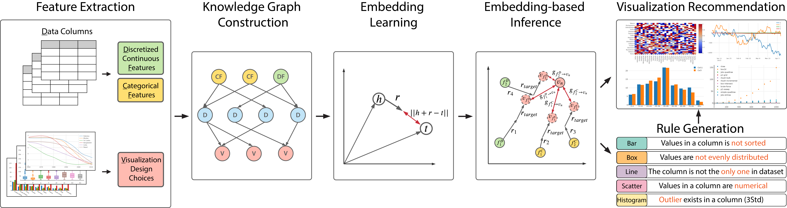

# Privacy-preserving Visualization for Mobile Devices

This repository contains the source code for our Eurovis 2023 paper, titled "Don't Peek at My Chart: Privacy-preserving Visualization for Mobile Devices." The project aims to provide a privacy-focused approach to data visualization on mobile devices, ensuring that sensitive information remains secure.


## Introduction

This is the code repository for our EuroVis23 Paper entitled "Privacy-preserving Visualization for Mobile Devices". We propose a perception-driven approach to transform mobile data visualizations into privacy-preserving ones.Specifically,based on human visual perception, we develop a masking scheme to adjust the spatial frequency and luminance contrast of colored visualizations.

You can also check our [project webpage](https://alexanderzsh.github.io/Privacy-preserving-visualization/) for more details.

## Citation

If you find our work useful in your research, please consider citing:

```
@ARTICLE{Zhang2023DontPA,
  title={Don't Peek at My Chart: Privacy-preserving Visualization for Mobile Devices},
  author={Songheng Zhang and Dong Ma and Yong Wang},
  journal={Computer Graphics Forum},
  year={2023},
  volume  = {},
  number  = {},
  pages   = {1-1}
}
```

## Installation

### Download the code

```
$ git clone https://github.com/AlexanderZsh/Privacy-preserving-visualization.git
```

### Code

- back_algorithm.py: This script defines the necessary functions to transform a visualization into a privacy-preserving visualization.
- example_privacy_preserving_area.ipynb: This notebook provides an example of how to use the functions defined in back_algorithm.py to transform an area-based visual mark into a privacy-preserving visualization.
- example_privacy_preserving_line.ipynb: Similarly, this notebook offers an example of applying the functions from back_algorithm.py to transform a line-based visual mark into a privacy-preserving visualization.

| Name         | Version |
| ------------ | ------- |
| python       | 3.8.8   |
| numpy        | 1.21.2  |
| easyocr      | 1.5.0   |
| opencv       | 4.5.3   |
| scikit-image | 0.18.3  |
| scipy        | 1.7.1   |
| matplotlib   | 3.4.3   |
